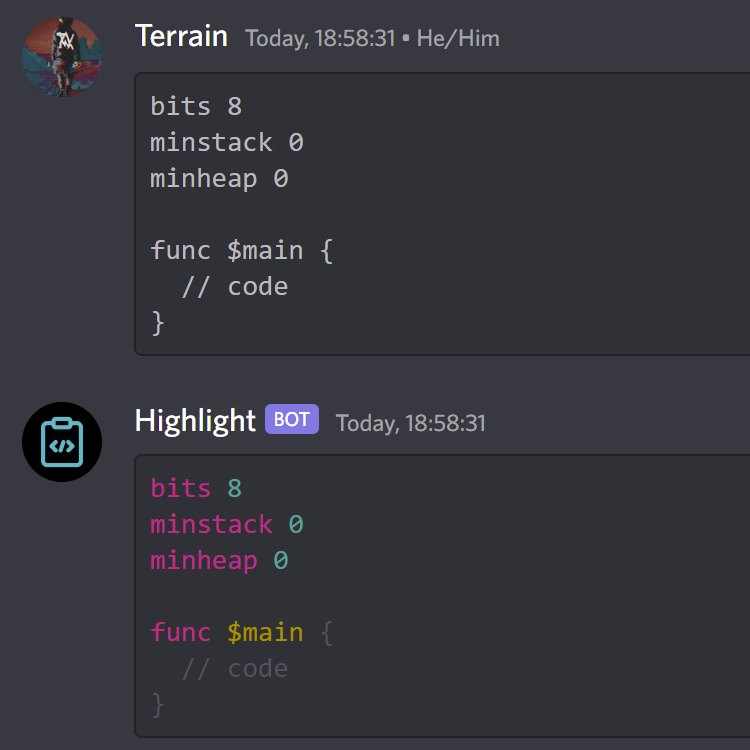
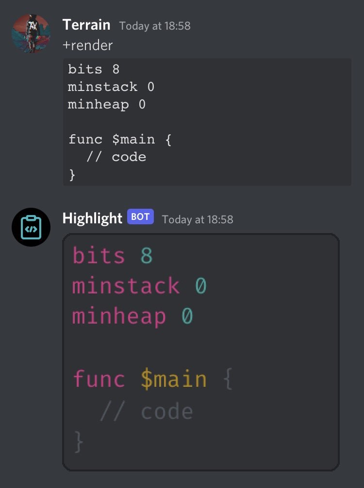

# Custom Discord Highlighter

This is a bot i originally made to highlight URSL, a little language i made. It also supports URCL, and i'm happy to add support for more languages, such as your own ISA. Just contact me if you'd like to add your language. The main server this bot is intended to run in is the [URCL discord server](https://discord.gg/Nv8jzWg5j8), but you're free to fork this, clone this, do whatever, and run it on your own servers. You can also [invite the bot](https://discord.com/api/oauth2/authorize?client_id=980132414305214505&permissions=2048&scope=bot), but please self-host it if possible so that i won't run into the guild limit for privileged intents. Or do invite it, maybe i can get the bot verified eventually.

It reacts to any message that looks like so:

````
```ursl
bits 8
func $main {
    // code
}
```
````

And responds with an ANSI-formatted syntax highlighting of that code:

````
```ansi
bits 8
func $main {
  // code
}
```
````

The above may not look great in wherever you're viewing this, but in discord that renders pretty nicely:



Now of course, that may not look too great on mobile, because (at least on iOS) discord mobile does not support syntax highlighting whatsoever, including ANSI. For that, there's the ``+render`` command:



This bot is easily extensible to any tree-sitter grammar. It responds to any message that is a codeblock (in a language it knows) and optionally a command it recognizes. ``+parse`` will just parse the codeblock's contents and dump the root node as an S-expression, and ``+highlight`` will print the ANSI highlighting. If there is no command at all and the message is a pure codeblock, it will default to ``+highlight``. If you're on mobile, you can also do ``+render`` to render it to an image, which will be easier to view on more platforms.

The color scheme of this bot's highlighting is generally based loosely on vscode's default theme of Dark+, with some compromises being made. Most notably, all literals are ``CYAN`` to match discord's default language settings.

If you wanna run this bot locally, create ``token`` file with the token in the root of this repository, add a font named ``font.ttf`` (i use [Fira Code](https://github.com/tonsky/FiraCode)) and then just ``cargo run``.

---

Avatar by [tezar tantular](https://thenounproject.com/icon/coding-2996800/0). I haven't modified the icon outside of the preview options The Noun Project provides. 