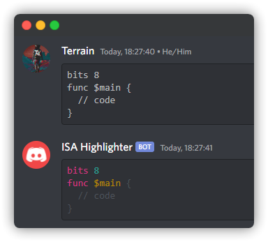

# Custom Discord Highlighter

This is a bot i made to highlight URSL, a little language i made. It also supports URCL, and as the bot's name suggests, i'm happy to add support for more languages, such as your own ISA. Just contact me if you'd like to add your language.

It reacts to any message that looks like so:

````
```ursl
bits 8
func $main {
    // code
}
```
````

And responds with an ANSI-formatted syntax highlighting of that code:

````
```ansi
bits 8
func $main {
  // code
}
```
````

The above may not look great in wherever you're viewing this, but in discord that renders pretty nicely:



This bot is easily extensible to any tree-sitter grammar. It responds to any message that is a codeblock, and optionally a command it recognizes. ``+parse`` will just parse the codeblock's contents and dump the root node as an S-expression, and ``+highlight`` will print the ANSI highlighting. If there is no command at all and the message is a pure codeblock, it will default to ``+highlight``.

If you wanna run this bot locally, create ``token`` file with the token in the root of this repository, and then just ``cargo run``